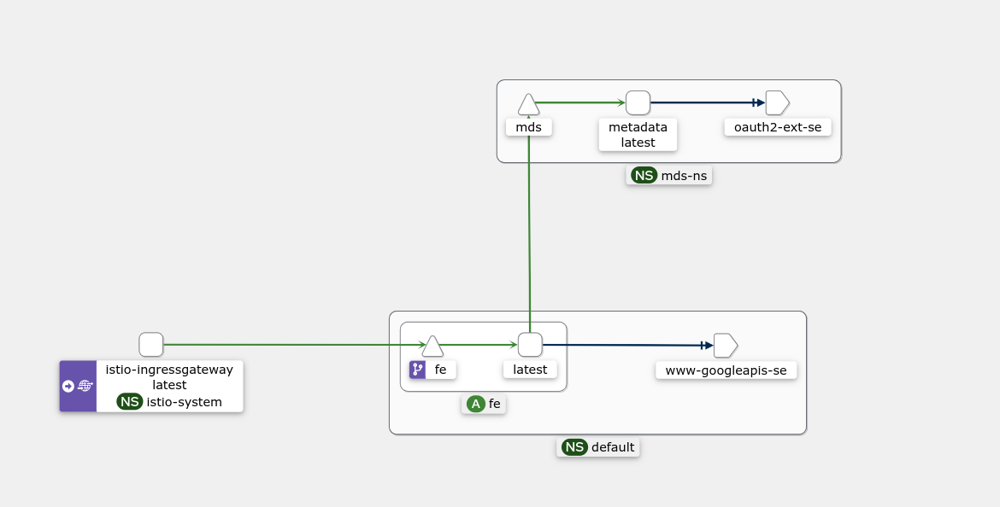

### Istio Kubernetes GCE Metadata Proxy

Access the GCE metadata server as a Kubernetes Service.   

This demo runs a [GCE Metadata Server Emulator](https://github.com/salrashid123/gce_metadata_server) as a restricted Service authorized using [Istio Authorization Policies](https://istio.io/latest/docs/reference/config/security/authorization-policy/).

Basically you can configure Istio such that only certain applications can access the metadata server.

For example, the following policy will allow access to the metadata server only from a pod that is associated with kubernetes service account `cluster.local/ns/default/sa/fe-sa`

```yaml
apiVersion: security.istio.io/v1
kind: AuthorizationPolicy
metadata:
 name: mds-az
 namespace: mds-ns
spec:
 action: ALLOW  
 selector:
   matchLabels:
     app: mds
 rules:
 - to:
   - operation:
       methods: ["GET"]  
   from:
   - source:
       principals: ["cluster.local/ns/default/sa/fe-sa"] 
```




The default metadata server returns an `access_token` that represents GCP one service account so if you wanted N kubernetes services each needing different GCP service accounts you could either

1. run N metadata servers or
2. multiplex/broker tokens based on the calling kubernetes service identity.

The setup below shows option (1)

Note, its preferred to  access GCP resources using federation as described here:

- [Using Kubernetes Service Accounts for Google Workload Identity Federation](https://github.com/salrashid123/k8s_federation_with_gcp)
- [GCP Workload Federation using Kubernetes SPIFFE mTLS](https://github.com/salrashid123/k8s_spiffe_mtls_federation_with_gcp)

but in the case you needed to run a metadata server, this setup will walk you though the steps.

For this, you'll need

* `minikube`
* ability to download a GCP service account key 

What we'll do is run two different frontend kubernetes services `fe` and `fe2` each running its  own kubernetes service account.

When each service is invoked, it will attempt to get an `access_token` which it will decode and return to the user the GCP service account's email

Only `fe` is authorized to access the metadata server


>> NOTE: this repo is _not_ supported by Google

---

### Setup

First install minikube

```bash
minikube start --driver=kvm2  --cpus=4 --kubernetes-version=v1.28 --host-only-cidr 192.168.39.1/24
minikube addons enable metallb

## get the IP, for me it was the following
$ minikube ip
192.168.39.1

## setup a loadbalancer metallb, enter the ip range shown below
minikube addons configure metallb
# -- Enter Load Balancer Start IP: 192.168.39.104
# -- Enter Load Balancer End IP: 192.168.39.110

## download and install istio
export ISTIO_VERSION=1.24.0 
export ISTIO_VERSION_MINOR=1.24

wget -P /tmp/ https://github.com/istio/istio/releases/download/$ISTIO_VERSION/istio-$ISTIO_VERSION-linux-amd64.tar.gz
tar xvf /tmp/istio-$ISTIO_VERSION-linux-amd64.tar.gz -C /tmp/
rm /tmp/istio-$ISTIO_VERSION-linux-amd64.tar.gz

export PATH=/tmp/istio-$ISTIO_VERSION/bin:$PATH

istioctl install --set profile=demo \
 --set meshConfig.enableAutoMtls=true  \
 --set values.gateways.istio-ingressgateway.runAsRoot=true \
 --set meshConfig.outboundTrafficPolicy.mode=REGISTRY_ONLY \
 --set meshConfig.defaultConfig.gatewayTopology.forwardClientCertDetails=SANITIZE_SET \
 --set meshConfig.defaultConfig.proxyConfig.proxyHeaders.forwardedClientCert=SANITIZE_SET \
 --set meshConfig.defaultConfig.proxyConfig.proxyHeaders.setCurrentClientCertDetails.subject=true \
 --set meshConfig.defaultConfig.proxyConfig.proxyHeaders.setCurrentClientCertDetails.cert=true

### in a new window, install prometheus, kaili, jager and grafana
kubectl apply -f https://raw.githubusercontent.com/istio/istio/release-$ISTIO_VERSION_MINOR/samples/addons/prometheus.yaml
sleep 20
kubectl apply -f https://raw.githubusercontent.com/istio/istio/release-$ISTIO_VERSION_MINOR/samples/addons/kiali.yaml
kubectl apply -f https://raw.githubusercontent.com/istio/istio/release-$ISTIO_VERSION_MINOR/samples/addons/grafana.yaml
kubectl apply -f https://raw.githubusercontent.com/istio/istio/release-$ISTIO_VERSION_MINOR/samples/addons/jaeger.yaml

## open a tunnel and access the kiali dashboard at  http://localhost:20001/kiali
kubectl -n istio-system port-forward $(kubectl -n istio-system get pod -l app.kubernetes.io/name=kiali -o jsonpath='{.items[0].metadata.name}') 20001:20001
```

Acquire the external loadbalancer IP

```bash
export GATEWAY_IP=$(kubectl -n istio-system get service istio-ingressgateway -o jsonpath='{.status.loadBalancer.ingress[0].ip}')
echo $GATEWAY_IP

## create the ingress gateway
kubectl apply -f istio-ingress-gateway.yaml

## kill and restart the ingress pod since the LB cert's may not have been loaded
INGRESS_POD_NAME=$(kubectl get po -n istio-system | grep ingressgateway\- | awk '{print$1}'); echo ${INGRESS_POD_NAME};
kubectl delete po/$INGRESS_POD_NAME -n istio-system
```

Now acquire the service account key.  We're using a key but in reality you could save the actual GCP service account to a TPM and access it directly from the MDS.  See

- [GCE MetadataServer Emulator with TPM](https://github.com/salrashid123/gce_metadata_server?tab=readme-ov-file#with-trusted-platform-module-tpm)
- [Kubernetes Trusted Platform Module (TPM) DaemonSet](https://github.com/salrashid123/tpm_daemonset)
- [Kubernetes Trusted Platform Module (TPM) using Device Plugin and Gatekeeper](https://github.com/salrashid123/tpm_kubernetes)

Anyway, for the demo, 

```bash
export PROJECT_ID=`gcloud config get-value core/project`
gcloud iam service-accounts create metadata-sa
gcloud iam service-accounts keys create metadata-sa.json --iam-account=metadata-sa@$PROJECT_ID.iam.gserviceaccount.com
export SA_CRED=`cat metadata-sa.json | base64  --wrap=0 -`

envsubst < "mds.tmpl" > "mds.yaml"
```

Now deploy the entire application.  You can find the source for the 'client' application (`docker.io/salrashid123/istioclient`) under `client/` folder.  

You are free to build and push your own client.

```bash
kubectl apply -f deployment.yaml -f istio-vs.yaml -f auth-policy.yaml -f mds.yaml
## you'll probably need to run the command above again since some resource creation didn't complete

## make sure the pods are running, for me it was
$ kubectl get po,svc,ing,ingress -n mds-ns 
NAME                       READY   STATUS    RESTARTS   AGE
pod/mds-75d96fcd46-lnrp4   2/2     Running   0          16m

NAME          TYPE        CLUSTER-IP    EXTERNAL-IP   PORT(S)    AGE
service/mds   ClusterIP   10.96.44.23   <none>        8080/TCP   16m

$ kubectl get po,svc,ing,ingress -n default
NAME                       READY   STATUS    RESTARTS   AGE
pod/fe-5746f57d45-vl8wg    2/2     Running   0          97s
pod/fe2-67dcb85b95-vxpmk   2/2     Running   0          97s

NAME                 TYPE        CLUSTER-IP      EXTERNAL-IP   PORT(S)    AGE
service/fe           ClusterIP   10.97.176.43    <none>        8080/TCP   17m
service/fe2          ClusterIP   10.109.77.159   <none>        8080/TCP   17m
service/kubernetes   ClusterIP   10.96.0.1       <none>        443/TCP    3h12m
```

Now access the frontend service `fe`, this should return the service account email

```bash
$ curl --cacert certs/root-ca.crt --cert certs/client.crt --key certs/client.key \
   --resolve istio.domain.com:443:$GATEWAY_IP \
   -H "Host: fe.example.com" -w "\n" https://istio.domain.com/get
   
metadata-sa@$PROJECT_ID.iam.gserviceaccount.com
```

If you access the `fe2` service, you'll see the rbac error since its not authorized to access the MDS

```bash
$ curl -s --cacert certs/root-ca.crt --cert certs/client.crt --key certs/client.key \
   --resolve istio.domain.com:443:$GATEWAY_IP \
   -H "Host: fe2.example.com" -w "\n" https://istio.domain.com/get

Error getting token compute: Received 403 `RBAC: access denied`
```

---

### Broker Tokens using X-Forwarded-Client-Cert

If you wanted to run one MDS server which selectively returns different `access_tokens` representing different GCP service accounts, you will need a way to identify  the calling kubernetes service.

Since we are using istio, and have enabled mandatory MTLS, we can use the following headers inbound to the MDS:

* [Envoy x-forwarded-client-cert](https://www.envoyproxy.io/docs/envoy/latest/configuration/http/http_conn_man/headers#config-http-conn-man-headers-x-forwarded-client-cert)
* [Envoy Configuring X-Forwarded-Client-Cert Headers](https://istio.io/latest/docs/ops/configuration/traffic-management/network-topologies/#configuring-x-forwarded-client-cert-headers)

eg

```bash
   X-Forwarded-Client-Cert:  By=spiffe://cluster.local/ns/default/sa/mds-sa;Hash=ec5dfa77cdf74dff213d788d6de58afbaeb6c36e6af561bf974f2a2871dcb2a8;Subject="";
```

Basically, these headers identify the calling service's URI which you can decode in a modified Metadata service to selectively return different tokens.

note, the release notes here for istio [1.24.0](https://istio.io/latest/news/releases/1.24.x/announcing-1.24/change-notes/) suggests a way to forward more details about the calling service account's certificate using a new `ProxyConfig` field: `proxyHeaders.setCurrentClientCertDetails`.  I haven't been able to get this to work so i've left the proxy config settings in anyway.

```yaml
apiVersion: networking.istio.io/v1beta1
kind: ProxyConfig
metadata:
  name: my-proxyconfig
  namespace: "istio-system"
spec:
  concurrency: 0
  image:
    imageType: distroless
  proxyHeaders:
    forwardedClientCert: SANITIZE_SET
    setCurrentClientCertDetails:
      subject: true
      cert: true
      uri: true
```

As a small local demo, run the `mdsbroker/` app

```bash
cd mdsbroker/
go run http_server.go
```

Then pretend to send the header in the call:

```bash
curl -v -H "Metadata-Flavor: Google" \
  -H 'X-Forwarded-Client-Cert: By=spiffe://cluster.local/ns/default/sa/mds-sa;Hash=ec5dfa77cdf74dff213d788d6de58afbaeb6c36e6af561bf974f2a2871dcb2a8;Subject="";URI=spiffe://cluster.local/ns/default/sa/fe-sa' \
  --connect-to metadata.google.internal:80:127.0.0.1:8080 \
   http://metadata.google.internal/computeMetadata/v1/instance/service-accounts/default/token
```

This demo app will parse the header, extract the `URI` field and return a dummy token that the calling service is authorized for

### Using Kubernetes Network Policy

Note, you can use kubernetes [Network Policy](https://kubernetes.io/docs/concepts/services-networking/network-policies/) to help control traffic to the MDS only from the `fe` pod.  If you are not using istio, following should restrict access from just the `fe` pods

```bash
minikube start --driver=kvm2  --cpus=4 \
  --kubernetes-version=v1.28 --network-plugin=cni --cni=calico --host-only-cidr 192.168.39.1/24

## note, network policies work on labels
kubectl label namespace default namespace=frontend
```

Then if you don't install istio, a sample policy maybe like this:

```yaml
kind: NetworkPolicy
apiVersion: networking.k8s.io/v1
metadata:
  name: allow-from-fe
  namespace: mds-ns
spec:
  policyTypes:
  - Ingress
  podSelector:
    matchLabels:
      app: mds
  ingress:
  - from:
    - namespaceSelector:
        matchLabels:
          namespace: frontend
      podSelector:
        matchLabels:
          app: fe
    ports:
    - protocol: TCP
      port: 8080
---
apiVersion: networking.k8s.io/v1
kind: NetworkPolicy
metadata:
  name: default-deny-all
  namespace: mds-ns  
spec:
  podSelector: {}
  policyTypes:
  - Ingress
```

Note, `Calico` seems to [allow service account restrictions](https://docs.tigera.io/calico/latest/network-policy/policy-rules/service-accounts#limit-ingress-traffic-for-workloads-by-service-account-name).

To enable calico and its CRDs, 

```bash
minikube start --driver=kvm2  --cpus=4 --kubernetes-version=v1.28 \
   --network-plugin=cni --cni=calico --host-only-cidr 192.168.39.1/24

kubectl label namespace default namespace=frontend
kubectl create -f https://raw.githubusercontent.com/projectcalico/calico/v3.29.0/manifests/tigera-operator.yaml
kubectl create -f https://raw.githubusercontent.com/projectcalico/calico/v3.29.0/manifests/custom-resources.yaml
kubectl get pods -n calico-system
```

Then a configuration like this would apply a service account restriction as well

```yaml
apiVersion: projectcalico.org/v3
kind: NetworkPolicy
metadata:
  name: default.default-deny
  namespace: mds-ns 
spec:
  tier: default
  selector: all()
  types:
    - Ingress
---
apiVersion: projectcalico.org/v3
kind: NetworkPolicy
metadata:
  name: sa-calico
  namespace: mds-ns  
spec:
  ingress:
    - action: Allow
      source:
        namespaceSelector: 'namespace == "frontend"' 
        serviceAccounts:
          names:
            - fe-sa
  selector: 'app == "mds"'
```

### References

- [External Authorization Server with Istio](https://github.com/salrashid123/istio_external_authorization_server.git)
- [Envoy External Authorization server (envoy.ext_authz) with OPA HelloWorld](https://github.com/salrashid123/envoy_external_authz)
